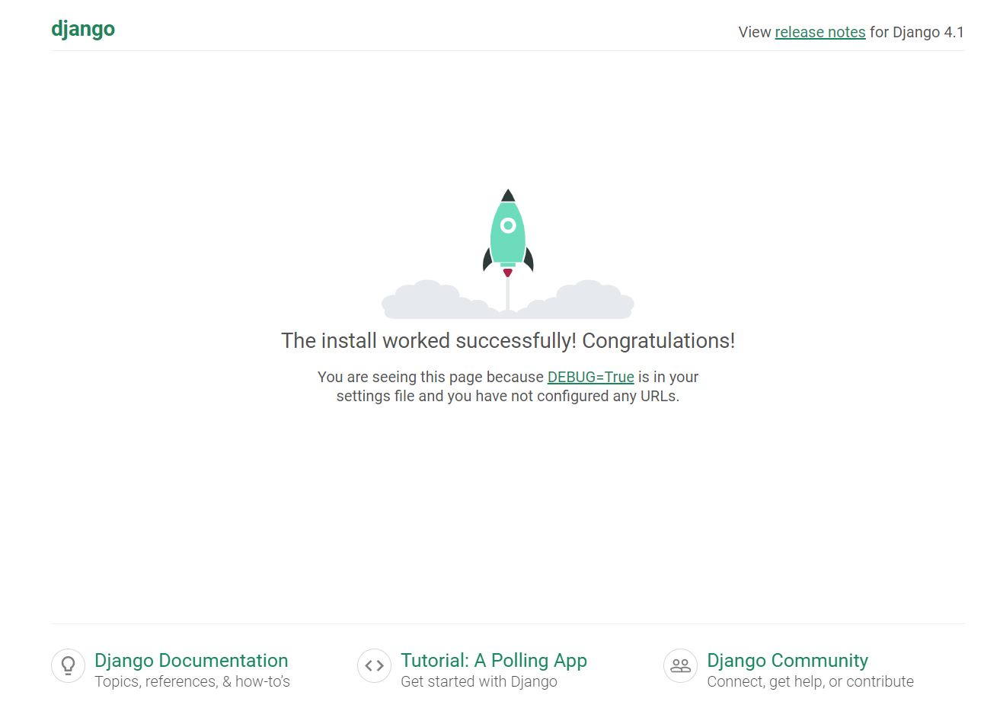

# django_first_work
## I started doing projects with django, which I have been working with for a while..

### I worked in this lesson; creating a project, adding an app, urls, model, view and template structure, using filters and tags in the template, adding static files, adding pictures and videos. 

